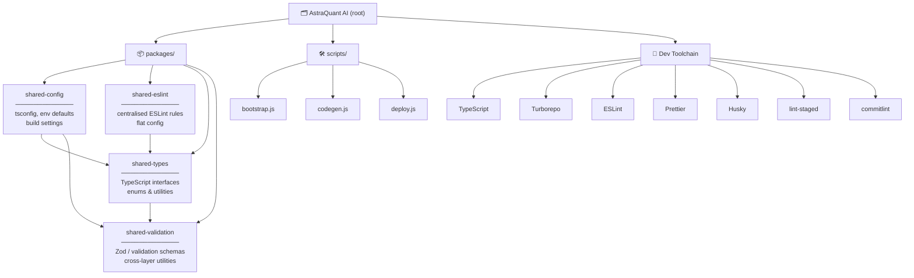

# AstraQuant AI


> A TypeScript monorepo powering AstraQuant AI — built with Turborepo for fast, cached task orchestration across shared packages, with strict code quality tooling enforced at commit time.

---

## Architecture



---

## Repository Layout

```
AstraQuant AI/
├── packages/
│   ├── shared-config/       # Shared configuration (tsconfig, env, build)
│   ├── shared-eslint/       # Shared ESLint flat config rule sets
│   ├── shared-types/        # TypeScript interfaces, enums & utilities
│   └── shared-validation/   # Validation schemas (Zod/Yup) & helpers
│
├── scripts/                 # Project-level automation scripts
└── turbo.json               # Turborepo pipeline configuration
```

---

## Shared Packages

### `packages/shared-config`
Common project configuration shared across all packages — TypeScript base config, environment defaults, and build settings. Every package extends this as its tsconfig base.

### `packages/shared-eslint`
Centralised ESLint configuration using flat config format. All packages reference this to keep linting rules consistent across the entire monorepo without duplication.

### `packages/shared-types`
TypeScript interfaces, enums, and type utilities used across multiple packages. Acts as the single source of truth for cross-cutting domain types (e.g. `OrderStatus`, `UserRole`, API response shapes).

### `packages/shared-validation`
Validation logic and schemas shared between frontend, backend, and API layers. Prevents duplicated validation rules and ensures consistent error messages everywhere.

---

## Toolchain

| Tool | Purpose |
|------|---------|
| [TypeScript](https://www.typescriptlang.org/) | Static typing across all packages |
| [Turborepo](https://turbo.build/) | Monorepo task orchestration & build caching |
| [ESLint](https://eslint.org/) | Linting with flat config |
| [Prettier](https://prettier.io/) | Opinionated code formatting |
| [Husky](https://typicode.github.io/husky/) | Git hooks (`pre-commit`, `commit-msg`) |
| [lint-staged](https://github.com/okonet/lint-staged) | Run linters on staged files only |
| [commitlint](https://commitlint.js.org/) | Enforce Conventional Commits spec |

---

## Getting Started

```bash
# Install dependencies
npm install

# Run all packages in dev mode
npx turbo dev

# Build all packages
npx turbo build

# Lint all packages
npx turbo lint

# Type-check all packages
npx turbo typecheck
```

---

## Code Quality

Quality is enforced automatically at commit time through a chain of Git hooks:

```
git commit
    │
    ├── pre-commit ──► lint-staged
    │                      ├── ESLint  (staged .ts/.tsx files)
    │                      └── Prettier (staged files)
    │
    └── commit-msg ──► commitlint
                           └── Conventional Commits validation
```

### Commit message format

```
<type>(scope): <description>
```

```bash
# Examples
feat(shared-types): add OrderStatus enum
fix(shared-validation): handle empty string edge case
refactor(shared-config): simplify tsconfig extends chain
chore: update dependencies
docs: add architecture diagram to README
```

Valid types: `feat` `fix` `chore` `docs` `style` `refactor` `perf` `test` `build` `ci`

---

## Scripts

Project-level scripts in `/scripts/` handle tasks outside the scope of individual packages — bootstrapping, code generation, deployment utilities, and other repo-wide automation.

---

## License

MIT © AstraQuant AI