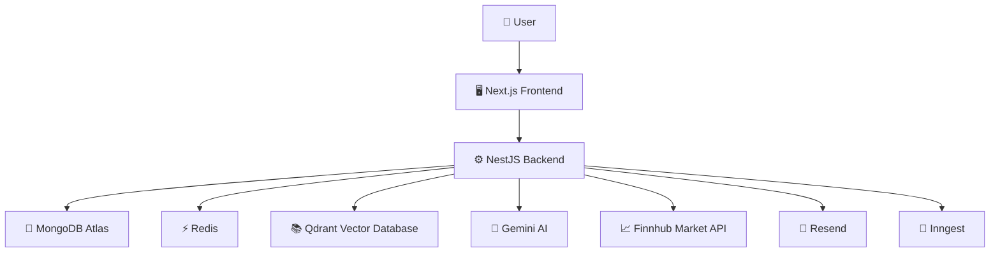
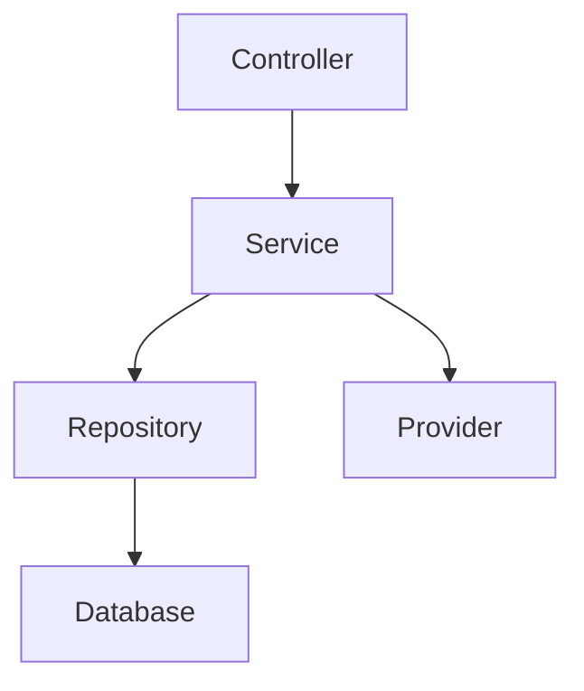
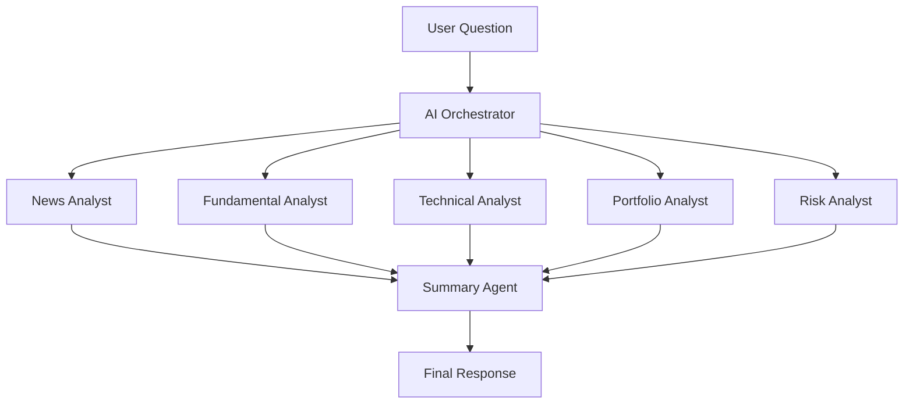
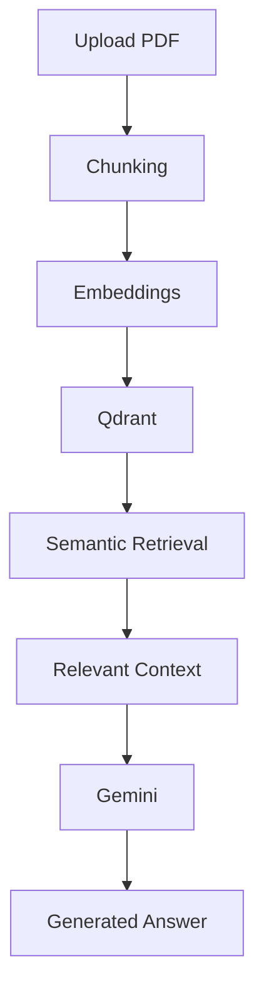
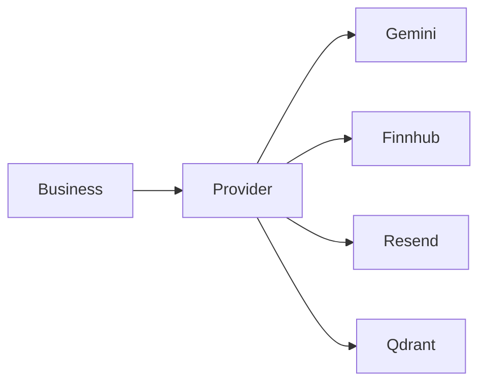

# 🚀 AstraQuant AI

<div align="center">

# AstraQuant AI

### AI-Powered Financial Intelligence Platform

**Research Smarter • Analyze Better • Invest with Confidence**

---


---

### 🚧 Status

> **Currently Under Active Development**

AstraQuant AI is being built as a **production-grade AI-powered Financial Intelligence Platform** using modern full-stack technologies and enterprise software engineering practices.

---

</div>

---

# 📖 Table of Contents

- [Project Vision](#-project-vision)
- [Problem Statement](#-problem-statement)
- [Why AstraQuant AI?](#-why-astraquant-ai)
- [Core Features](#-core-features)
- [System Overview](#-system-overview)
- [Technology Stack](#-technology-stack)
- [Architecture Overview](#-architecture-overview)
- [Repository Structure](#-repository-structure)
- [Current Progress](#-current-progress)
- [Development Roadmap](#-development-roadmap)

---

# 🌟 Project Vision

AstraQuant AI is an **AI-powered Financial Intelligence Platform** designed to help investors, analysts, researchers, and financial professionals make smarter decisions using Artificial Intelligence.

Unlike traditional stock market applications that only display charts and prices, AstraQuant AI combines multiple intelligent systems into a single research platform.

The goal is to create an **AI Financial Research Copilot** capable of understanding financial data, analyzing portfolios, interpreting company reports, tracking market sentiment, identifying investment risks, and generating actionable insights.

---

# ❗ Problem Statement

Modern investing suffers from a major problem:

Information is everywhere.

Investors must constantly switch between:

- Financial news websites
- Company annual reports
- Earnings reports
- Stock screeners
- Portfolio trackers
- Research articles
- SEC filings
- Analyst reports

Every platform solves only one small part of the problem.

As a result:

- Research becomes slow
- Important information gets missed
- Decision making becomes difficult
- Retail investors struggle against institutional tools

---

# 💡 Why AstraQuant AI?

AstraQuant AI brings everything together into one intelligent platform.

Instead of opening ten different websites, users should be able to ask:

> "Analyze NVIDIA's latest earnings report."

> "Compare Microsoft and Amazon based on profitability and debt."

> "Summarize today's important AI market news."

> "What are the biggest risks in my portfolio?"

> "Explain why this stock dropped today."

The AI researches the information, retrieves relevant documents, analyzes financial data, and produces an intelligent response.

---

# 🎯 Core Features

## 📈 Market Intelligence

- Live Market Data
- Stock Search
- Company Profiles
- Historical Price Analysis
- Market Pulse Dashboard

---

## 💼 Portfolio Analytics

- Portfolio Management
- Holdings Tracking
- Profit & Loss Analysis
- Asset Allocation
- Diversification Analysis
- Performance Monitoring

---

## 📰 Financial News Intelligence

- Real-time Financial News
- AI News Summaries
- Sentiment Analysis
- Event Detection
- Company-specific News Feed

---

## 📑 Document Intelligence

Upload and analyze:

- Annual Reports
- Quarterly Reports
- Earnings Reports
- Investor Presentations
- Financial Statements
- Research Papers

---

## 🤖 AI Research Copilot

Users can ask natural language questions such as:

- Explain this company's financial health.
- Compare two companies.
- Summarize this earnings report.
- Identify investment risks.
- Explain important financial ratios.
- Generate investment research.

---

## 🧠 Retrieval-Augmented Generation (RAG)

Instead of relying only on LLM knowledge, AstraQuant AI retrieves relevant financial documents before generating responses.

This improves:

- Accuracy
- Reliability
- Explainability
- Context Awareness

---

## ⚠️ Risk Intelligence

- Portfolio Risk Analysis
- Company Risk Assessment
- Sector Exposure
- Volatility Analysis
- AI-generated Risk Reports

---

## 📊 Automated Financial Briefings

Generate personalized reports including:

- Portfolio Summary
- Market Highlights
- News Summary
- Company Research
- Risk Alerts

---

# 🌍 System Overview

```text
                   User
                     │
                     ▼
          Next.js Frontend
                     │
                     ▼
             NestJS Backend
                     │
     ┌───────────────┼───────────────┐
     ▼               ▼               ▼
 Market Data      AI Engine      Portfolio
     │               │               │
     └───────────────┼───────────────┘
                     ▼
            Financial Intelligence
```

---

# 🎯 Project Goals

The primary objectives of AstraQuant AI are:

- Build a production-grade financial research platform.
- Provide intelligent investment insights.
- Automate financial research.
- Simplify portfolio management.
- Improve investment decision making.
- Demonstrate enterprise software architecture.
- Showcase modern AI application development.

---

# ⭐ Project Philosophy

AstraQuant AI follows one simple principle:

> **"Don't just display financial data. Understand it."**

Every feature is designed around helping users gain meaningful insights rather than overwhelming them with raw information.

---
---

# 🏗️ Architecture Overview

AstraQuant AI follows a **Modular Monolith Architecture**.

Instead of splitting everything into microservices too early, the application is organized into independent business modules inside a single backend.

This approach provides:

- Faster development
- Easier debugging
- Better maintainability
- Simpler deployment
- Lower operational complexity

As the application grows, individual modules can later be extracted into independent services if required.

---

# 🌐 High-Level System Architecture



---

# 🖥️ Frontend Architecture

The frontend is built using **Next.js App Router** with a **Feature-Based Architecture**.

Instead of organizing files by type, every business feature owns its components, hooks, services, and utilities.

Benefits:

- High scalability
- Easier maintenance
- Better code ownership
- Reduced coupling
- Faster onboarding

---

## Planned Folder Structure

```text
src/

app/

components/

features/
│
├── auth/
├── dashboard/
├── portfolio/
├── watchlists/
├── stocks/
├── research/
├── news/
├── market-pulse/
├── risk/
└── settings/

hooks/

lib/

services/

types/

utils/
```

---

## Frontend Technology Stack

| Technology | Purpose |
|------------|----------|
| Next.js | React Framework |
| React | UI Library |
| TypeScript | Static Typing |
| Tailwind CSS | Styling |
| shadcn/ui | UI Components |
| React Hook Form | Forms |
| Zod | Validation |
| Zustand | Local State |
| TanStack Query | Server State |
| TradingView | Advanced Charts |
| Recharts | Analytics Charts |

---

# ⚙️ Backend Architecture

The backend follows a **Modular Monolith** architecture.

Each business domain owns its own module.

Modules communicate through services instead of direct database access.

---

## Planned Backend Modules

```text
backend/

src/

modules/

├── auth/
├── users/
├── stocks/
├── portfolio/
├── watchlists/
├── research/
├── documents/
├── news/
├── risk/
├── market-pulse/
├── ai/
├── notifications/
└── health/
```

---

## Backend Layers



---

## Why This Architecture?

Separating responsibilities provides:

- Better maintainability
- Easier testing
- Cleaner code
- Better scalability
- Lower coupling

Each layer has one responsibility.

Controllers never contain business logic.

Repositories never contain AI logic.

Providers never contain domain logic.

---

# 🧠 AI Architecture

Artificial Intelligence is the core of AstraQuant AI.

Instead of using one giant prompt, the system uses multiple specialized AI agents coordinated through an AI Orchestrator.

---

## AI Flow



---

## AI Agents

### 📰 News Analyst

Responsible for:

- Financial news
- Sentiment analysis
- Breaking news
- Event detection

---

### 📊 Fundamental Analyst

Responsible for:

- Revenue
- Profitability
- Debt
- Balance Sheet
- Cash Flow

---

### 📈 Technical Analyst

Responsible for:

- Indicators
- Moving Averages
- RSI
- MACD
- Trend Analysis

---

### 💼 Portfolio Analyst

Responsible for:

- Diversification
- Allocation
- P/L
- Exposure
- Optimization

---

### ⚠️ Risk Analyst

Responsible for:

- Portfolio Risk
- Company Risk
- Sector Risk
- Volatility

---

### 🧾 Summary Agent

Combines outputs from all other agents into one coherent, human-readable response.

---

# 📚 RAG Architecture

AstraQuant AI uses Retrieval-Augmented Generation (RAG) to answer questions based on uploaded financial documents.

Instead of relying only on the LLM's knowledge, relevant document chunks are retrieved before generating a response.

---

## RAG Pipeline



---

## Supported Documents

- Annual Reports
- Quarterly Reports
- SEC Filings
- Investor Presentations
- Balance Sheets
- Income Statements
- Cash Flow Statements
- Research Reports

---

# 🗄️ Database Architecture

MongoDB Atlas is used as the primary database.

Collections are organized by business domain.

---

## Planned Collections

```text
users

refresh_tokens

watchlists

portfolios

holdings

transactions

stocks

news_articles

documents

document_chunks

research_sessions

alerts
```

---

## Database Design Principles

- Soft Deletes
- Auditing Fields
- Repository Pattern
- Module Ownership
- Index Optimization
- Scalability First

---

# 🔄 External Provider Architecture

Business logic never communicates directly with external SDKs.

Everything goes through provider abstractions.



This architecture makes providers easily replaceable in the future.

Examples:

- Gemini → OpenAI
- Finnhub → Polygon
- Resend → SendGrid

without changing business logic.

---
---

# 💻 Technology Stack

AstraQuant AI is built using a modern, scalable, and production-ready technology stack. Every technology has been selected after evaluating multiple alternatives with a focus on maintainability, performance, developer experience, and long-term scalability.

---

# 🖥️ Frontend

| Technology | Purpose | Why It Was Chosen |
|------------|---------|-------------------|
| Next.js 16 | React Framework | Server Components, App Router, SSR, excellent ecosystem |
| React 19 | UI Library | Industry standard for modern web applications |
| TypeScript | Language | Static typing, scalability, improved developer productivity |
| Tailwind CSS | Styling | Utility-first CSS framework for rapid UI development |
| shadcn/ui | UI Components | Accessible, customizable, production-ready components |
| React Hook Form | Forms | High-performance form management |
| Zod | Validation | Type-safe runtime validation |
| TanStack Query | Server State | Efficient API caching and synchronization |
| Zustand | Client State | Lightweight global state management |
| Recharts | Analytics Charts | Portfolio and dashboard visualizations |
| TradingView Widgets | Financial Charts | Professional-grade stock charts |

---

# ⚙️ Backend

| Technology | Purpose | Why It Was Chosen |
|------------|---------|-------------------|
| NestJS | Backend Framework | Enterprise architecture, dependency injection, modular design |
| TypeScript | Language | Shared types between frontend and backend |
| Mongoose | ODM | Schema validation and MongoDB integration |
| Class Validator | Validation | DTO validation |
| Swagger | API Documentation | Automatic API documentation |

---

# 🗄️ Database

| Technology | Purpose |
|------------|----------|
| MongoDB Atlas | Primary database |
| Redis | Cache, sessions, rate limiting |
| Qdrant | Vector database for semantic search |

---

# 🤖 Artificial Intelligence

| Technology | Purpose |
|------------|----------|
| Gemini | Large Language Model |
| RAG | Retrieval-Augmented Generation |
| AI Orchestrator | Coordinates specialized AI agents |

---

# ☁️ External Services

| Service | Purpose |
|----------|----------|
| Finnhub | Market data |
| Resend | Email delivery |
| Inngest | Background jobs and workflows |

---

# 🧪 Testing

| Tool | Purpose |
|------|----------|
| Vitest | Unit Testing |
| React Testing Library | Component Testing |
| Playwright | End-to-End Testing |

---

# 📦 Monorepo

| Tool | Purpose |
|------|----------|
| pnpm | Package manager |
| Turborepo | Monorepo build system |
| ESLint | Linting |
| Prettier | Formatting |
| Husky | Git hooks |
| Commitlint | Conventional commits |

---

# 📂 Repository Structure

```text
astraquant-ai/

│
├── .github/                  # GitHub workflows & templates
├── apps/
│   ├── frontend/             # Next.js application
│   └── backend/              # NestJS application
│
├── packages/
│   ├── shared-config/        # Shared configuration
│   ├── shared-eslint/        # Shared ESLint config
│   ├── shared-types/         # Shared TypeScript types
│   └── shared-validation/    # Shared validation schemas
│
├── docs/                     # Documentation
├── infrastructure/           # Docker & infrastructure
├── scripts/                  # Automation scripts
│
├── package.json
├── pnpm-workspace.yaml
├── turbo.json
├── tsconfig.base.json
├── .editorconfig
├── .gitignore
├── .env.example
└── README.md
```

---

# 📁 Folder Explanation

## apps/

Contains all runnable applications.

Current applications:

- Frontend
- Backend

Future applications may include:

- Admin Dashboard
- Documentation Site
- Mobile Application

---

## packages/

Reusable code shared across multiple applications.

Examples:

- Shared Types
- Validation Schemas
- Configurations
- ESLint Rules

This avoids code duplication.

---

## docs/

Contains:

- Architecture documents
- ADRs
- API documentation
- Design documents
- Development guides

---

## infrastructure/

Contains infrastructure-related resources.

Examples:

- Docker Compose
- Kubernetes
- Deployment manifests
- Terraform (future)

---

## scripts/

Repository-wide automation.

Examples:

- Bootstrap
- Code generation
- Deployment
- Maintenance utilities

---

# 🏛️ Engineering Principles

AstraQuant AI follows a strict engineering philosophy inspired by enterprise software development.

---

## 1. Architecture Before Implementation

Design first.

Code second.

A well-designed system scales.

A poorly-designed system accumulates technical debt.

---

## 2. Simplicity Over Complexity

Avoid unnecessary abstractions.

Every layer should exist for a reason.

---

## 3. Production-First Development

Every feature should be built as if it will be deployed to production.

No "temporary" code.

No shortcuts.

---

## 4. Scalability

The architecture should support future growth without requiring major rewrites.

---

## 5. Security First

Security is not an afterthought.

Authentication, validation, authorization, and data protection are considered from the beginning.

---

## 6. Provider Independence

Business logic never depends directly on third-party SDKs.

Providers are abstracted behind interfaces.

This allows changing vendors with minimal effort.

---

## 7. Type Safety

TypeScript strict mode is enabled throughout the project.

Shared types ensure consistency between frontend and backend.

---

## 8. Single Responsibility Principle

Every module should have one clear responsibility.

Examples:

- Portfolio Module
- Watchlist Module
- AI Module
- News Module

---

## 9. Clean Architecture

Business logic should remain independent of:

- Frameworks
- Databases
- AI providers
- External APIs

---

## 10. Continuous Improvement

The architecture will evolve over time through documented Architecture Decision Records (ADRs).

---

# 🏗️ Architecture Decision Records (ADRs)

Major technical decisions are documented to explain **why** they were made.

Examples include:

| Decision | Status |
|----------|--------|
| Modular Monolith | ✅ Accepted |
| Next.js Frontend | ✅ Accepted |
| NestJS Backend | ✅ Accepted |
| MongoDB Atlas | ✅ Accepted |
| Qdrant Vector Database | ✅ Accepted |
| Gemini AI | ✅ Accepted |
| Provider Abstraction | ✅ Accepted |
| Turborepo Monorepo | ✅ Accepted |

---

# 🌿 Git Workflow

Branching strategy:

```text
main
│
├── develop
│
├── feature/authentication
├── feature/portfolio
├── feature/watchlists
├── feature/research
├── feature/rag
└── feature/notifications
```

---

## Commit Convention

Conventional Commits are used throughout the project.

Examples:

```text
feat(auth): add JWT authentication

fix(portfolio): correct profit calculation

docs(readme): update architecture diagram

refactor(ai): simplify orchestrator

test(news): add unit tests

chore(deps): update dependencies
```

---

# 🔄 Development Workflow

```text
Plan
   │
   ▼
Design
   │
   ▼
Architecture Review
   │
   ▼
Implementation
   │
   ▼
Testing
   │
   ▼
Code Review
   │
   ▼
Merge
   │
   ▼
Deployment
```

---

# 📌 Coding Standards

Every contribution should follow:

- TypeScript Strict Mode
- ESLint Rules
- Prettier Formatting
- Conventional Commits
- Modular Design
- Clean Code Principles
- SOLID Principles
- DRY (Don't Repeat Yourself)
- KISS (Keep It Simple, Stupid)

---
---

# 🚀 Local Development

## Prerequisites

Before running AstraQuant AI locally, ensure the following tools are installed:

| Software | Version |
|----------|----------|
| Node.js | >=22 |
| pnpm | >=11 |
| Git | Latest |
| Docker Desktop | Latest |
| VS Code | Recommended |

---

## Clone the Repository

```bash
git clone https://github.com/KumarSambhav01/AstraQuant-AI.git

cd AstraQuant-AI
```

---

## Install Dependencies

```bash
pnpm install
```

---

## Start Development

```bash
pnpm dev
```

---

## Build

```bash
pnpm build
```

---

## Lint

```bash
pnpm lint
```

---

## Format Code

```bash
pnpm format
```

---

## Type Check

```bash
pnpm typecheck
```

---

# ⚙️ Environment Variables

The application uses environment variables for secrets and service configuration.

Create a `.env.local` file for the frontend and a `.env` file for the backend using the provided `.env.example` template.

Example:

```env
# MongoDB
MONGODB_URI=

# Redis
REDIS_URL=

# Gemini
GEMINI_API_KEY=

# Finnhub
FINNHUB_API_KEY=

# Qdrant
QDRANT_URL=
QDRANT_API_KEY=

# Resend
RESEND_API_KEY=

# JWT
JWT_SECRET=
JWT_REFRESH_SECRET=
```

> **Never commit real API keys or secrets to Git.**

---

# 📈 Current Project Status

## ✅ Completed

### Planning

- Project Vision
- Technology Stack
- Software Architecture
- Repository Design

### Repository

- GitHub Repository
- Monorepo Setup
- Turborepo
- pnpm Workspace
- Shared Packages
- Development Tooling

### Frontend

- Next.js Application Scaffold

---

## 🚧 In Progress

- Repository Configuration Audit
- Frontend Verification

---

## 📅 Upcoming

- NestJS Backend
- MongoDB Integration
- Redis Integration
- Authentication
- Market Data Module
- Portfolio Module
- Watchlists
- News Intelligence
- AI Orchestrator
- Document Intelligence (RAG)
- Risk Analytics
- Notifications
- Testing
- CI/CD
- Deployment

---

# 🛣️ Development Roadmap

## Phase 1 — Foundation

- [x] Project Planning
- [x] Repository Setup
- [x] Monorepo Configuration
- [x] Frontend Scaffold
- [ ] Frontend Verification
- [ ] Backend Scaffold

---

## Phase 2 — Backend Foundation

- [ ] NestJS
- [ ] Logger
- [ ] Config Module
- [ ] Global Validation
- [ ] Global Exception Filter
- [ ] Health Module
- [ ] Swagger
- [ ] MongoDB
- [ ] Redis

---

## Phase 3 — Authentication

- [ ] JWT Authentication
- [ ] Refresh Tokens
- [ ] User Module
- [ ] Role-Based Access Control

---

## Phase 4 — Market Data

- [ ] Finnhub Integration
- [ ] Market Data Provider
- [ ] Stock Search
- [ ] Company Profiles

---

## Phase 5 — Portfolio

- [ ] Portfolio CRUD
- [ ] Holdings
- [ ] Transactions
- [ ] Portfolio Analytics

---

## Phase 6 — Watchlists

- [ ] Watchlist CRUD
- [ ] Alerts
- [ ] Price Tracking

---

## Phase 7 — News Intelligence

- [ ] News Aggregation
- [ ] Sentiment Analysis
- [ ] AI Summaries

---

## Phase 8 — AI Research Copilot

- [ ] AI Orchestrator
- [ ] Fundamental Analyst
- [ ] Technical Analyst
- [ ] News Analyst
- [ ] Portfolio Analyst
- [ ] Risk Analyst
- [ ] Summary Agent

---

## Phase 9 — Document Intelligence

- [ ] PDF Upload
- [ ] Chunking
- [ ] Embeddings
- [ ] Qdrant Integration
- [ ] Semantic Search
- [ ] AI Question Answering

---

## Phase 10 — Risk Analytics

- [ ] Portfolio Risk
- [ ] Company Risk
- [ ] Sector Risk
- [ ] AI Risk Reports

---

## Phase 11 — Notifications

- [ ] Email Notifications
- [ ] Scheduled Reports
- [ ] Market Alerts

---

## Phase 12 — Testing

- [ ] Unit Tests
- [ ] Integration Tests
- [ ] End-to-End Tests

---

## Phase 13 — CI/CD

- [ ] GitHub Actions
- [ ] Automated Testing
- [ ] Docker Images
- [ ] Deployment Pipeline

---

## Phase 14 — Production

- [ ] Cloud Deployment
- [ ] Monitoring
- [ ] Logging
- [ ] Analytics

---

# 🎯 Long-Term Vision

AstraQuant AI aims to evolve into a comprehensive AI-powered financial intelligence ecosystem capable of:

- AI Investment Research
- Portfolio Optimization
- Financial Document Analysis
- Institutional-Grade Market Intelligence
- Personalized Financial Briefings
- Explainable AI Recommendations
- Multi-Agent Financial Analysis
- Enterprise API Platform

The long-term goal is to create a platform where users can understand financial markets through natural language rather than manually processing large amounts of data.

---

# 🤝 Contributing

At this stage, AstraQuant AI is an actively developed personal project.

Future contributions may be welcomed once the architecture and core modules are stable.

---

# 📜 License

This project is currently licensed under **UNLICENSED**.

The source code is publicly visible for learning and portfolio purposes but may not be copied, modified, or redistributed without explicit permission from the author.

---

# 👨‍💻 Author

**Kumar Sambhav**

- GitHub: https://github.com/KumarSambhav01
- LinkedIn: https://www.linkedin.com/in/kumar-sambhav-965866301/

---

# ⭐ Support the Project

If you found this project interesting:

- ⭐ Star the repository
- 🍴 Follow the development
- 💡 Share feedback
- 🐛 Report issues
- 📖 Watch the project as it evolves

---

<div align="center">

## 🚀 Building the Future of AI-Powered Financial Intelligence

*"Transforming financial data into actionable intelligence through modern software engineering and Artificial Intelligence."*

**Thank you for visiting AstraQuant AI!**

</div>